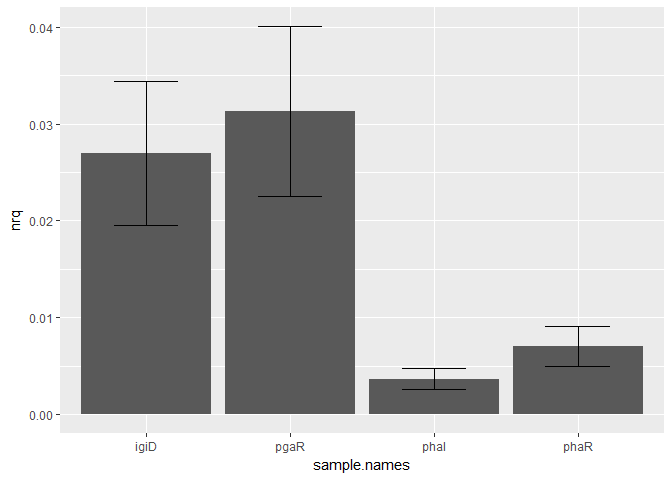
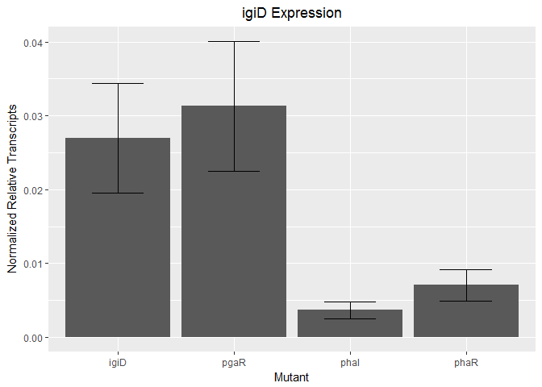
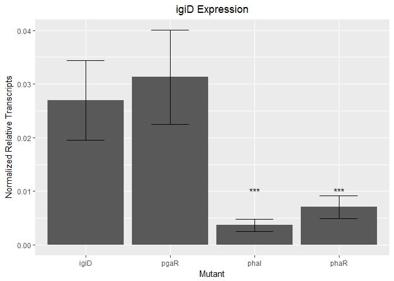

Data Analysis
================
April Armes
May 5, 2017

Introduction
============

Gene transcripts based on normalized relative quanities (nrq) are often difficult to calculate. Here, I present script written that calculates nrq based on efficiency (E) and cycle threshold (Ct) values generated by quantitaive-Polymerase Chain Reaction. Note that this script is only useful for relative quantification of gene expression. It requires several dataframes in which there are three technical replicates for your control, experimental, 3 reference genes, and at least one gene of interest (GOI).

Here, I am measuring the expression of igiD as my GOI. Comparing this value in four experimental mutants to the wildtype (WT) control. Each mutant GOI as well as 3 reference genes (alaS, map, rpoC) will be compared to that of WT. The E and Ct values generated by qPCR for each of these genes will be used to calculate nqr. Nqr is then used to determine the upregulation or down regulation of a gene.

``` r
### Libraries needed for this script
library(dplyr)
```

    ## 
    ## Attaching package: 'dplyr'

    ## The following objects are masked from 'package:stats':
    ## 
    ##     filter, lag

    ## The following objects are masked from 'package:base':
    ## 
    ##     intersect, setdiff, setequal, union

``` r
library(ggplot2)
```

The Data
========

For the purpose of this script and data analysis, each qPCR run is set up in a .csv file. This file contains the control mutant (Y4I), one experimental mutant, replicate number, the gene measured (alaS, map, rpoC, igiD), their E and Ct values.

Part I
------

### Comparing Y4I and pgaR

*The data frame should be set up with columns labeled "sample", "gene", "replicate", "E", and "Ct" *Generate data frame with the above specified columns. Can be entered at .csv

``` r
test3 <- read.csv("../590_final/test3.csv")

##this code reads a .csv file from a relative pathway into an object called test3. Passing commands through objects saves them to the global enviroment which allows viewing at any time
```

*Calculate the geometric mean of "E", the geometric standard deviation of "E", the average cycle threshold ("Ct"), and the standard deviation of the average "Ct" of each gene in each sample *This is where your replicates come in. In order to calculate these values you must have more than 1 value to input

``` r
## In order to calculate geometric mean and geometric standard deviation, I had to write a couple functions
## geo_mean and geo_sd functions

#this function calculates the geometric mean of a vector
geo_mean <- function(x) {  
  #need to put if statements into function
  geomean <- exp(sum(log(x[x > 0]), na.rm = TRUE) / length(x))
  return(geomean)
}

#this function calculates the geometric stadard deviation of a vector
geo_sd <- function(x) {
  #need to put if statements into function
  geosd <- exp(sd(log(1+x)-1))-1
  return(geosd)
}
```

\*Create a data frame that contains the above calculations

``` r
data1 <- test3 %>% 
  group_by(gene, sample) %>% #this data set is grouped by gene and sample in order to calculate geo_mean, geo_sd, average "Ct", and standard deviation of "Ct" by each gene in each sample
  summarise(geo.mean = geo_mean(E), 
            geo.sd = geo_sd(E),
            Mean.Ct = mean(ct), 
            SD.Ct = sd(ct)
  )
## test3 is piped into this grouping which is then passed through summarise, creating a new dataframe with new columns
## new columns (left side of equation) = geo.mean, geo.sd, Mean.Ct, and SD.Ct
## functions/calculations are on the right side of the equation. 
# must have exisiting columns in dataframe from which to calculate new values (ie "E", "ct"). 

print(data1) #prints table to console so that you can make sure everything is working
```

    ## Source: local data frame [8 x 6]
    ## Groups: gene [?]
    ## 
    ##     gene sample geo.mean     geo.sd  Mean.Ct     SD.Ct
    ##   <fctr> <fctr>    <dbl>      <dbl>    <dbl>     <dbl>
    ## 1   alaS   pgaR 2.171896 0.07512793 27.30333 0.3952636
    ## 2   alaS    Y4I 2.202949 0.09841919 28.38000 0.2893095
    ## 3   igiD   pgaR 2.229535 0.01742841 30.65000 0.9429740
    ## 4   igiD    Y4I 1.857409 0.04295229 26.91333 0.3971566
    ## 5    map   pgaR 2.245579 0.07286401 24.61333 0.4600362
    ## 6    map    Y4I 2.250980 0.03951272 25.63667 0.1903506
    ## 7   rpoC   pgaR 2.494758 0.03481291 23.57333 0.5416949
    ## 8   rpoC    Y4I 2.117206 0.06532380 25.93333 0.1446836

-   Calculate the difference in Mean.Ct between samples \*Because this task reduces the number of rows in the dataframe, we must print a new table

``` r
data2 <- 
  ungroup(data1) %>% # we want to ungroup our df to go back to the original (no longer grouping by both gene and sample)
  group_by(gene) %>% # then we want to regroup by gene
  summarise(d.Ct = Mean.Ct[sample == "Y4I"] - Mean.Ct[sample == "pgaR"]) #this will create a new table with the desired values
print(data2)
```

    ## # A tibble: 4 × 2
    ##     gene      d.Ct
    ##   <fctr>     <dbl>
    ## 1   alaS  1.076667
    ## 2   igiD -3.736667
    ## 3    map  1.023333
    ## 4   rpoC  2.360000

``` r
## this half step is necessary to join the exisiting df (data1 and data2) to perform the next set of calculations 
data2.5 <- data1 %>% 
  filter(sample == "Y4I") %>% #here we take data1 and filter out everything expect for values for our control sample ("Y4I")
  left_join(data2, by = "gene") %>% #then we join this df to data2 and organize by the column gene, this works because there are the same number of values for each column
  mutate(rq = geo.mean[sample == "Y4I"]^d.Ct[sample == "Y4I"], #next we add two new columns using the mutate function that calculate relative quantification (rq) based on Ct values
         rq.sd = rq*sqrt((d.Ct*geo.sd/geo.mean)^2 + (log(geo.mean)*SD.Ct)^2)# and the sd of rq
  )
print(data2.5)
```

    ## Source: local data frame [4 x 9]
    ## Groups: gene [4]
    ## 
    ##     gene sample geo.mean     geo.sd  Mean.Ct     SD.Ct      d.Ct
    ##   <fctr> <fctr>    <dbl>      <dbl>    <dbl>     <dbl>     <dbl>
    ## 1   alaS    Y4I 2.202949 0.09841919 28.38000 0.2893095  1.076667
    ## 2   igiD    Y4I 1.857409 0.04295229 26.91333 0.3971566 -3.736667
    ## 3    map    Y4I 2.250980 0.03951272 25.63667 0.1903506  1.023333
    ## 4   rpoC    Y4I 2.117206 0.06532380 25.93333 0.1446836  2.360000
    ## # ... with 2 more variables: rq <dbl>, rq.sd <dbl>

*Generate a table with the Normalization factor(nf), sd of nf, Normalized Relative Quantity (nrq), and sd of nrq *This must be generated in a new table because only one value for each column will be generated

``` r
data3 <- 
  ungroup(data2.5) %>% #it is neccessary to ungroup this df 
  summarise(nf = ((rq[gene == "alaS"]*rq[gene == "map"]*rq[gene == "rpoC"])^(1/3)),
            nf.sd = nf*sqrt((rq.sd[gene == "rpoC"]/(3*rq[gene == "rpoC"]))^2 + 
                              ((rq.sd[gene == "map"])/(3*rq[gene == "map"]))^2 + 
                              ((rq.sd[gene == "alaS"])/(3*rq[gene == "alaS"]))^2),
            nrq = rq[gene == "igiD"]/nf,
            nrq.sd = nrq*sqrt((nf.sd/nf)^2 + (rq.sd[gene == "igiD"]/rq[gene == "igiD"])^2)
  )
##the summarise function creates a new table and creates four new columns of one value each
print(data3)
```

    ## # A tibble: 1 × 4
    ##         nf     nf.sd        nrq     nrq.sd
    ##      <dbl>     <dbl>      <dbl>      <dbl>
    ## 1 3.159114 0.3258973 0.03130524 0.00877562

Because this is only one comparison between GOI in experimental sample and GOI in control, we must run several more df This is where writing functions/package would be useful.

### Part II

Comparing Y4I and phaR
======================

This uses the same script as above

``` r
test4 <- read.csv("../590_final/test4.csv")

data4 <- test4 %>% 
  group_by(gene, sample) %>% 
  summarise(geo.mean = geo_mean(E), 
            geo.sd = geo_sd(E),
            Mean.Ct = mean(ct), 
            SD.Ct = sd(ct)
  )

print(data4) 
```

    ## Source: local data frame [8 x 6]
    ## Groups: gene [?]
    ## 
    ##     gene sample geo.mean     geo.sd  Mean.Ct      SD.Ct
    ##   <fctr> <fctr>    <dbl>      <dbl>    <dbl>      <dbl>
    ## 1   alaS   phaR 2.216298 0.04995725 25.94667 0.38279673
    ## 2   alaS    Y4I 2.202949 0.09841919 28.38000 0.28930952
    ## 3   igiD   phaR 1.595089 0.06090868 32.43000 0.14798649
    ## 4   igiD    Y4I 1.857409 0.04295229 26.91333 0.39715656
    ## 5    map   phaR 2.336751 0.04628606 24.31667 0.20792627
    ## 6    map    Y4I 2.250980 0.03951272 25.63667 0.19035055
    ## 7   rpoC   phaR 2.152040 0.02941786 23.76333 0.09073772
    ## 8   rpoC    Y4I 2.117206 0.06532380 25.93333 0.14468356

``` r
data5 <- 
  ungroup(data4) %>% 
  group_by(gene) %>% 
  summarise(d.Ct = Mean.Ct[sample == "Y4I"] - Mean.Ct[sample == "phaR"]) 
print(data2)
```

    ## # A tibble: 4 × 2
    ##     gene      d.Ct
    ##   <fctr>     <dbl>
    ## 1   alaS  1.076667
    ## 2   igiD -3.736667
    ## 3    map  1.023333
    ## 4   rpoC  2.360000

``` r
data5.5 <- data4 %>% 
  filter(sample == "Y4I") %>% 
  left_join(data5, by = "gene") %>% 
  mutate(rq = geo.mean[sample == "Y4I"]^d.Ct[sample == "Y4I"], 
         rq.sd = rq*sqrt((d.Ct*geo.sd/geo.mean)^2 + (log(geo.mean)*SD.Ct)^2)
  )
print(data5.5)
```

    ## Source: local data frame [4 x 9]
    ## Groups: gene [4]
    ## 
    ##     gene sample geo.mean     geo.sd  Mean.Ct     SD.Ct      d.Ct
    ##   <fctr> <fctr>    <dbl>      <dbl>    <dbl>     <dbl>     <dbl>
    ## 1   alaS    Y4I 2.202949 0.09841919 28.38000 0.2893095  2.433333
    ## 2   igiD    Y4I 1.857409 0.04295229 26.91333 0.3971566 -5.516667
    ## 3    map    Y4I 2.250980 0.03951272 25.63667 0.1903506  1.320000
    ## 4   rpoC    Y4I 2.117206 0.06532380 25.93333 0.1446836  2.170000
    ## # ... with 2 more variables: rq <dbl>, rq.sd <dbl>

``` r
data6<- 
  ungroup(data5.5) %>%  
  summarise(nf = ((rq[gene == "alaS"]*rq[gene == "map"]*rq[gene == "rpoC"])^(1/3)),
            nf.sd = nf*sqrt((rq.sd[gene == "rpoC"]/(3*rq[gene == "rpoC"]))^2 + 
                              ((rq.sd[gene == "map"])/(3*rq[gene == "map"]))^2 + 
                              ((rq.sd[gene == "alaS"])/(3*rq[gene == "alaS"]))^2),
            nrq = rq[gene == "igiD"]/nf,
            nrq.sd = nrq*sqrt((nf.sd/nf)^2 + (rq.sd[gene == "igiD"]/rq[gene == "igiD"])^2)
  )

print(data6)
```

    ## # A tibble: 1 × 4
    ##        nf     nf.sd         nrq      nrq.sd
    ##     <dbl>     <dbl>       <dbl>       <dbl>
    ## 1 4.66545 0.5031555 0.007040986 0.002093181

Part III
--------

Comparing Y4I and phaI
----------------------

This uses the same script as above

``` r
test5 <- read.csv("../590_final/test5.csv")
print(test5)
```

    ##    sample gene replicate    E    ct
    ## 1     Y4I rpoC         1 1.90 26.10
    ## 2     Y4I rpoC         2 2.25 25.84
    ## 3     Y4I rpoC         3 2.22 25.86
    ## 4     Y4I  map         1 2.19 25.82
    ## 5     Y4I  map         2 2.40 25.65
    ## 6     Y4I  map         3 2.17 25.44
    ## 7     Y4I alaS         1 2.55 28.59
    ## 8     Y4I alaS         2 1.95 28.05
    ## 9     Y4I alaS         3 2.15 28.50
    ## 10    Y4I igiD         1 1.80 27.08
    ## 11    Y4I igiD         2 1.78 27.20
    ## 12    Y4I igiD         3 2.00 26.46
    ## 13   phaI rpoC         1 2.22 23.80
    ## 14   phaI rpoC         2 2.19 23.66
    ## 15   phaI rpoC         3 2.05 23.83
    ## 16   phaI  map         1 2.67 23.99
    ## 17   phaI  map         2 2.48 24.08
    ## 18   phaI  map         3 2.31 23.49
    ## 19   phaI alaS         1 2.28 26.72
    ## 20   phaI alaS         2 2.07 27.10
    ## 21   phaI alaS         3 2.56 25.89
    ## 22   phaI igiD         1 1.88 33.84
    ## 23   phaI igiD         2 1.64 33.73
    ## 24   phaI igiD         3 1.76 33.08

``` r
data7 <- test5 %>% 
  group_by(gene, sample) %>% 
  summarise(geo.mean = geo_mean(E), 
            geo.sd = geo_sd(E),
            Mean.Ct = mean(ct), 
            SD.Ct = sd(ct)
  )

print(data7) 
```

    ## Source: local data frame [8 x 6]
    ## Groups: gene [?]
    ## 
    ##     gene sample geo.mean     geo.sd  Mean.Ct      SD.Ct
    ##   <fctr> <fctr>    <dbl>      <dbl>    <dbl>      <dbl>
    ## 1   alaS   phaI 2.294643 0.07700170 26.57000 0.61878914
    ## 2   alaS    Y4I 2.202949 0.09841919 28.38000 0.28930952
    ## 3   igiD   phaI 1.757268 0.04446952 33.55000 0.41073106
    ## 4   igiD    Y4I 1.857409 0.04295229 26.91333 0.39715656
    ## 5    map   phaI 2.482323 0.05298540 23.85333 0.31785741
    ## 6    map    Y4I 2.250980 0.03951272 25.63667 0.19035055
    ## 7   rpoC   phaI 2.152040 0.02941786 23.76333 0.09073772
    ## 8   rpoC    Y4I 2.117206 0.06532380 25.93333 0.14468356

``` r
data8 <- 
  ungroup(data7) %>% 
  group_by(gene) %>% 
  summarise(d.Ct = Mean.Ct[sample == "Y4I"] - Mean.Ct[sample == "phaI"]) 
print(data8)
```

    ## # A tibble: 4 × 2
    ##     gene      d.Ct
    ##   <fctr>     <dbl>
    ## 1   alaS  1.810000
    ## 2   igiD -6.636667
    ## 3    map  1.783333
    ## 4   rpoC  2.170000

``` r
data8.5 <- data7 %>% 
  filter(sample == "Y4I") %>% 
  left_join(data8, by = "gene") %>% 
  mutate(rq = geo.mean[sample == "Y4I"]^d.Ct[sample == "Y4I"], 
         rq.sd = rq*sqrt((d.Ct*geo.sd/geo.mean)^2 + (log(geo.mean)*SD.Ct)^2)
  )
print(data8.5)
```

    ## Source: local data frame [4 x 9]
    ## Groups: gene [4]
    ## 
    ##     gene sample geo.mean     geo.sd  Mean.Ct     SD.Ct      d.Ct
    ##   <fctr> <fctr>    <dbl>      <dbl>    <dbl>     <dbl>     <dbl>
    ## 1   alaS    Y4I 2.202949 0.09841919 28.38000 0.2893095  1.810000
    ## 2   igiD    Y4I 1.857409 0.04295229 26.91333 0.3971566 -6.636667
    ## 3    map    Y4I 2.250980 0.03951272 25.63667 0.1903506  1.783333
    ## 4   rpoC    Y4I 2.117206 0.06532380 25.93333 0.1446836  2.170000
    ## # ... with 2 more variables: rq <dbl>, rq.sd <dbl>

``` r
data9 <- 
  ungroup(data8.5) %>%  
  summarise(nf = ((rq[gene == "alaS"]*rq[gene == "map"]*rq[gene == "rpoC"])^(1/3)),
            nf.sd = nf*sqrt((rq.sd[gene == "rpoC"]/(3*rq[gene == "rpoC"]))^2 + 
                              ((rq.sd[gene == "map"])/(3*rq[gene == "map"]))^2 + 
                              ((rq.sd[gene == "alaS"])/(3*rq[gene == "alaS"]))^2),
            nrq = rq[gene == "igiD"]/nf,
            nrq.sd = nrq*sqrt((nf.sd/nf)^2 + (rq.sd[gene == "igiD"]/rq[gene == "igiD"])^2)
  )

print(data9)
```

    ## # A tibble: 1 × 4
    ##         nf     nf.sd         nrq     nrq.sd
    ##      <dbl>     <dbl>       <dbl>      <dbl>
    ## 1 4.487936 0.4726981 0.003658507 0.00112834

Part IV
-------

### Comparing Y4I and igiD

This uses the same script as above

``` r
test6 <- read.csv("../590_final/test6.csv")
print(test6)
```

    ##    sample gene replicate    E    ct
    ## 1     Y4I rpoC         1 1.90 26.10
    ## 2     Y4I rpoC         2 2.25 25.84
    ## 3     Y4I rpoC         3 2.22 25.86
    ## 4     Y4I  map         1 2.19 25.82
    ## 5     Y4I  map         2 2.40 25.65
    ## 6     Y4I  map         3 2.17 25.44
    ## 7     Y4I alaS         1 2.55 28.59
    ## 8     Y4I alaS         2 1.95 28.05
    ## 9     Y4I alaS         3 2.15 28.50
    ## 10    Y4I igiD         1 1.80 27.08
    ## 11    Y4I igiD         2 1.78 27.20
    ## 12    Y4I igiD         3 2.00 26.46
    ## 13   igiD rpoC         1 1.78 21.64
    ## 14   igiD rpoC         2 1.74 21.66
    ## 15   igiD rpoC         3 1.76 21.56
    ## 16   igiD  map         1 1.86 22.52
    ## 17   igiD  map         2 1.94 22.49
    ## 18   igiD  map         3 2.09 22.27
    ## 19   igiD alaS         1 1.95 24.84
    ## 20   igiD alaS         2 1.88 24.48
    ## 21   igiD alaS         3 1.98 24.80
    ## 22   igiD igiD         1 1.74 28.76
    ## 23   igiD igiD         2 1.58 27.61
    ## 24   igiD igiD         3 1.80 27.76

``` r
data10 <- test6 %>% 
  group_by(gene, sample) %>% 
  summarise(geo.mean = geo_mean(E), 
            geo.sd = geo_sd(E),
            Mean.Ct = mean(ct), 
            SD.Ct = sd(ct)
  )

print(data10) 
```

    ## Source: local data frame [8 x 6]
    ## Groups: gene [?]
    ## 
    ##     gene sample geo.mean      geo.sd  Mean.Ct      SD.Ct
    ##   <fctr> <fctr>    <dbl>       <dbl>    <dbl>      <dbl>
    ## 1   alaS   igiD 1.936210 0.017686234 24.70667 0.19731531
    ## 2   alaS    Y4I 2.202949 0.098419191 28.38000 0.28930952
    ## 3   igiD   igiD 1.704092 0.043309799 28.04333 0.62516664
    ## 4   igiD    Y4I 1.857409 0.042952291 26.91333 0.39715656
    ## 5    map   igiD 1.961042 0.039979350 22.42667 0.13650397
    ## 6    map    Y4I 2.250980 0.039512717 25.63667 0.19035055
    ## 7   rpoC   igiD 1.759924 0.007272839 21.62000 0.05291503
    ## 8   rpoC    Y4I 2.117206 0.065323803 25.93333 0.14468356

``` r
data11 <- 
  ungroup(data10) %>% 
  group_by(gene) %>% 
  summarise(d.Ct = Mean.Ct[sample == "Y4I"] - Mean.Ct[sample == "igiD"]) 
print(data11)
```

    ## # A tibble: 4 × 2
    ##     gene      d.Ct
    ##   <fctr>     <dbl>
    ## 1   alaS  3.673333
    ## 2   igiD -1.130000
    ## 3    map  3.210000
    ## 4   rpoC  4.313333

``` r
data11.5 <- data10 %>% 
  filter(sample == "Y4I") %>% 
  left_join(data11, by = "gene") %>% 
  mutate(rq = geo.mean[sample == "Y4I"]^d.Ct[sample == "Y4I"], 
         rq.sd = rq*sqrt((d.Ct*geo.sd/geo.mean)^2 + (log(geo.mean)*SD.Ct)^2)
  )
print(data11.5)
```

    ## Source: local data frame [4 x 9]
    ## Groups: gene [4]
    ## 
    ##     gene sample geo.mean     geo.sd  Mean.Ct     SD.Ct      d.Ct
    ##   <fctr> <fctr>    <dbl>      <dbl>    <dbl>     <dbl>     <dbl>
    ## 1   alaS    Y4I 2.202949 0.09841919 28.38000 0.2893095  3.673333
    ## 2   igiD    Y4I 1.857409 0.04295229 26.91333 0.3971566 -1.130000
    ## 3    map    Y4I 2.250980 0.03951272 25.63667 0.1903506  3.210000
    ## 4   rpoC    Y4I 2.117206 0.06532380 25.93333 0.1446836  4.313333
    ## # ... with 2 more variables: rq <dbl>, rq.sd <dbl>

``` r
data12<- 
  ungroup(data11.5) %>%  
  summarise(nf = ((rq[gene == "alaS"]*rq[gene == "map"]*rq[gene == "rpoC"])^(1/3)),
            nf.sd = nf*sqrt((rq.sd[gene == "rpoC"]/(3*rq[gene == "rpoC"]))^2 + 
                              ((rq.sd[gene == "map"])/(3*rq[gene == "map"]))^2 + 
                              ((rq.sd[gene == "alaS"])/(3*rq[gene == "alaS"]))^2),
            nrq = rq[gene == "igiD"]/nf,
            nrq.sd = nrq*sqrt((nf.sd/nf)^2 + (rq.sd[gene == "igiD"]/rq[gene == "igiD"])^2)
  )

print(data12)
```

    ## # A tibble: 1 × 4
    ##         nf    nf.sd        nrq      nrq.sd
    ##      <dbl>    <dbl>      <dbl>       <dbl>
    ## 1 18.42478 2.262071 0.02696076 0.007443757

Data Analysis
=============

This script uses the normalized relative quantities generated through the calculations above to determine gene expression of the GOI. As the expression is normalized to reference genes, which are assumed to be constant, anything below 1 is down regulated and anything above 1 is upregulated.

### Getting the relevant data

-   Combine nrq from all data sets into one table by sample name
-   Create a new dataframe with all samples ( pgaR, phaR, phaI, igiD) and the nrq for each sample

``` r
#This creates a list with the sample names
sample.names <- c("pgaR", "phaR", "phaI", "igiD") 
y4i.values <- c(0, 0, 1, 0)

#This coerces the list into a data frame
df.sample <- as.data.frame(sample.names, row.names = NULL) 
print(df.sample)
```

    ##   sample.names
    ## 1         pgaR
    ## 2         phaR
    ## 3         phaI
    ## 4         igiD

``` r
#y4i.df <-as.data.frame(y4i.values, row.names = NULL)
#print(y4i.df)

#This creates a data frame from the last data set from each sample comparison by binding rows
#Then it adds the previous data frame containing sample names
#and selects the relevant columns
df <- data3 %>%
  bind_rows(data6, data9, data12) %>%
  bind_cols(df.sample) %>%
  select(nrq, nrq.sd, sample.names)

print(df)
```

    ## # A tibble: 4 × 3
    ##           nrq      nrq.sd sample.names
    ##         <dbl>       <dbl>       <fctr>
    ## 1 0.031305238 0.008775620         pgaR
    ## 2 0.007040986 0.002093181         phaR
    ## 3 0.003658507 0.001128340         phaI
    ## 4 0.026960759 0.007443757         igiD

### Plotting the data

``` r
p1 <- p<-ggplot(data = df, aes (x = sample.names, y = nrq))+ geom_bar(stat="identity", position = "dodge")+ geom_errorbar(aes(ymax = nrq + nrq.sd, ymin = nrq - nrq.sd), width = 0.45)  #bar plot with error bars using data summary with sample averages and standard devations. 
print (p1)
```



``` r
# add chart title, rename x and y labels
p2 <- p1 + ggtitle("igiD Expression") + theme(plot.title = element_text(hjust = 0.5)) + ylab("Normalized Relative Transcripts") + xlab("Mutant")
print(p2)
```



``` r
#add asteriks over significantly different expression
label.phaI <-data.frame (sample.names = c( "phaI"), nrq = c(0.01))
label.phaR <- data.frame (sample.names = c( "phaR"), nrq = c(0.01))
p3 <-p2 + geom_text(data = label.phaI, label = "***")
p4 <- p3 + geom_text(data = label.phaR, label = "***")
plot(p4)
```



As shown from igiD Expression plot, the expression of igiD is downregulated in all mutants when compared to wildtype.
